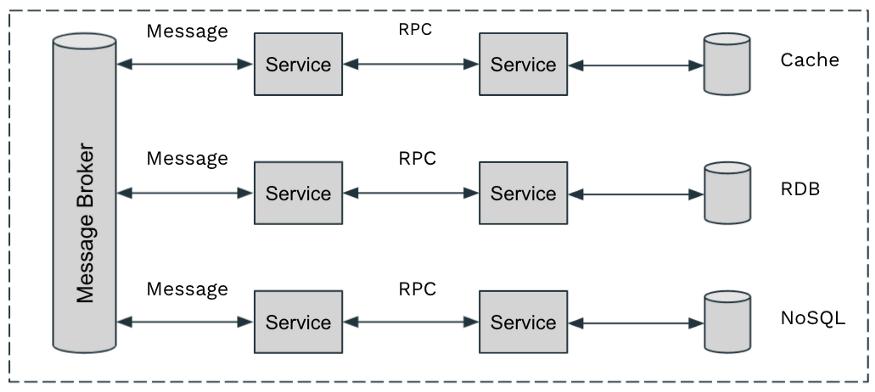
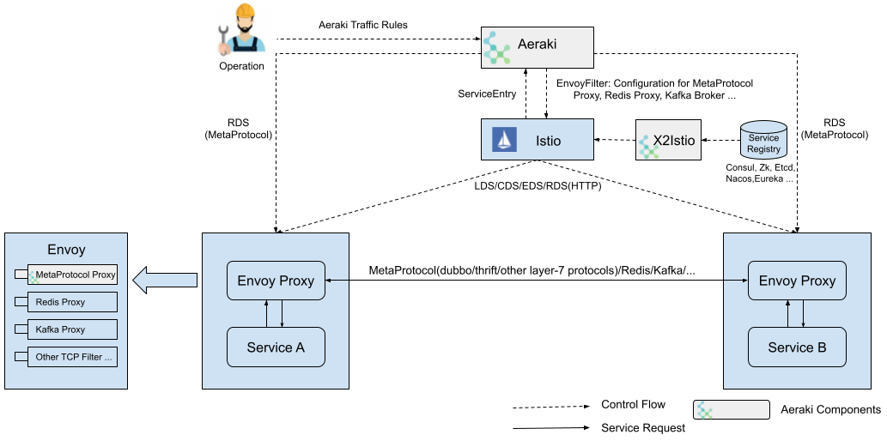

<!--
# Copyright Aeraki Authors
#
# Licensed under the Apache License, Version 2.0 (the "License");
# you may not use this file except in compliance with the License.
# You may obtain a copy of the License at
#
#     http://www.apache.org/licenses/LICENSE-2.0
#
# Unless required by applicable law or agreed to in writing, software
# distributed under the License is distributed on an "AS IS" BASIS,
# WITHOUT WARRANTIES OR CONDITIONS OF ANY KIND, either express or implied.
# See the License for the specific language governing permissions and
# limitations under the License.
-->

# Aeraki

[](https://github.com/aeraki-mesh/aeraki/blob/master/LICENSE)
[](https://goreportcard.com/report/github.com/aeraki-mesh/aeraki)
[](https://github.com/aeraki-mesh/aeraki/actions?query=branch%3Amaster+event%3Apush+workflow%3A%22ci%22)
[](https://github.com/aeraki-mesh/aeraki/actions?query=branch%3Amaster+event%3Apush+workflow%3A%22e2e-metaprotocol%22)
[](https://github.com/aeraki-mesh/aeraki/actions?query=branch%3Amaster+event%3Apush+workflow%3A%22e2e-dubbo%22)
[](https://github.com/aeraki-mesh/aeraki/actions?query=branch%3Amaster+event%3Apush+workflow%3A%22e2e-thrift%22)
[](https://github.com/aeraki-mesh/aeraki/actions?query=branch%3Amaster+event%3Apush+workflow%3A%22e2e-kafka-zookeeper%22)
[](https://github.com/aeraki-mesh/aeraki/actions?query=branch%3Amaster+event%3Apush+workflow%3A%22e2e-redis%22)

# Manage **any** layer-7 traffic in a service mesh!

**Aeraki** [Air-rah-ki] is the Greek word for 'breeze'. While service mesh becomes an important infrastructure for microservices, many(if not all) service mesh implementations mainly focus on HTTP protocols and treat other protocols as plain TCP traffic. Aeraki Mesh is created to provide a non-intrusive, highly extendable way to manage any layer 7 traffic in a service mesh. 

Note: Aeraki only handles none-HTTP laery-7 traffic in a service mesh, and leaves the HTTP traffic to other existing service mesh projects. (As they have already done a very good job on it, and we don't want to reinvent the wheel! ) 
Aeraki currently can be integrated with Istio, and it may support other service mesh projects in the future.

## Problems to solve

We are facing some challenges in service meshes:
* Istio and other popular service mesh implementations have very limited support for layer 7 protocols other than HTTP and gRPC.
* Envoy RDS(Route Discovery Service) is solely designed for HTTP. Other protocols such as Dubbo and Thrift can only use listener in-line routes for traffic management, which breaks existing connections when routes change.
* It takes a lot of effort to introduce a proprietary protocol into a service mesh. You’ll need to write an Envoy filter to handle the traffic in the data plane, and a control plane to manage those Envoy proxies.

Those obstacles make it very hard, if not impossible, for users to manage the traffic of other widely-used layer 7 protocols in microservices. For example, in a microservices application, we may have the below protocols:

* RPC: HTTP, gRPC, Thrift, Dubbo, Proprietary RPC Protocol …
* Messaging: Kafka, RabbitMQ …
* Cache: Redis, Memcached …
* Database: MySQL, PostgreSQL, MongoDB …



If you have already invested a lot of effort in migrating to a service mesh, of course, you want to get the most out of it — managing the traffic of all the protocols in your microservices.

## Aeraki's approach

To address these problems, Aeraki Mesh providing a non-intrusive, extendable way to manage any layer 7 traffic in a service mesh.


As this diagram shows, Aeraki Mesh consists of the following components:

* Aeraki: [Aeraki](https://github.com/aeraki-mesh/aeraki) provides high-level, user-friendly traffic management rules to operations, translates the rules to envoy filter configurations, and leverages Istio’s `EnvoyFilter` API to push the configurations to the sidecar proxies. Aeraki also serves as the RDS server for MetaProtocol proxies in the data plane. Contrary to Envoy RDS, which focuses on HTTP, Aeraki RDS is aimed to provide a general dynamic route capability for all layer-7 protocols.
* MetaProtocol Proxy: [MetaProtocol Proxy](https://github.com/aeraki-mesh/meta-protocol-proxy) provides common capabilities for Layer-7 protocols, such as load balancing, circuit breaker, load balancing, routing, rate limiting, fault injection, and auth. Layer-7 protocols can be built on top of MetaProtocol. To add a new protocol into the service mesh, the only thing you need to do is implementing the [codec interface](https://github.com/aeraki-mesh/meta-protocol-proxy/blob/ac788327239bd794e745ce18b382da858ddf3355/src/meta_protocol_proxy/codec/codec.h#L118) and a couple of lines of configuration. If you have special requirements which can’t be accommodated by the built-in capabilities, MetaProtocol Proxy also has an application-level filter chain mechanism, allowing users to write their own layer-7 filters to add custom logic into MetaProtocol Proxy.

[Dubbo](https://github.com/aeraki-mesh/meta-protocol-proxy/tree/master/src/application_protocols/dubbo) and [Thrift](https://github.com/aeraki-mesh/meta-protocol-proxy/tree/master/src/application_protocols/thrift) have already been implemented based on MetaProtocol. More protocols are on the way. If you're using a close-source, proprietary protocol, you can also manage it in your service mesh simply by writing a MetaProtocol codec for it.

Most request/response style, stateless protocols can be built on top of the MetaProtocol Proxy. However, some protocols' routing policies are too "special" to be normalized in MetaProtocol. For example, Redis proxy uses a slot number to map a client query to a specific Redis server node, and the slot number is computed by the key in the request. Aeraki can still manage those protocols as long as there's an available Envoy Filter in the Envoy proxy side. Currently, for protocols in this category, [Redis](https://github.com/aeraki-mesh/aeraki/blob/master/docs/zh/redis.md) and Kafka are supported in Aeraki.
## Reference
* [Implement an application protocol](docs/metaprotocol.md)
* [Dubbo (中文) ](https://github.com/aeraki-mesh/dubbo2istio#readme)
* [Redis (中文) ](docs/zh/redis.md)
* [LazyXDS（xDS 按需加载）](lazyxds/README.md)

## Supported protocols:
Aeraki can manage the below protocols in a service mesh：
* Dubbo (Envoy native filter）
* Thrift (Envoy native filter)
* Kafka (Envoy native filter)
* Redis (Envoy native filter)
* MetaProtocol-Dubbo
* MetaProtocol-Thfirt
* MetaProtocol-QQ music(QQ 音乐)
* MetaProtcool-Yangshiping(央视频)
* MetaProtocol-Private protocol: Have a private protocol? No problem, any layer-7 protocols built on top of the [MetaProtocol](https://github.com/aeraki-mesh/meta-protocol-proxy) can be managed by Aeraki

Supported Features:
  * Traffic Management
    * [x] Request Level Load Balancing/Locality Load Balancing (Supports Consistent Hash/Session Sticky)
    * [x] Circuit breaking
    * [x] Flexible Route Match Conditions (any properties can be exacted from layer-7 packet and used as mach conditions)
    * [x] Dynamic route update through Aeraki MetaRDS
    * [x] Version Based Routing
    * [x] Traffic Splittin
    * [x] Local Rate Limit
    * [x] Global Rate Limit
    * [x] Message mutation
    * [ ] Traffic Mirroring
    * [ ] Request Transformation
  * Observability
    * [x] Request level Metrics (Request latency, count, error, etc)
    * [ ] Distributed Tracing
  * Security 
    * [x] Peer Authorization on Interface/Method
    * [ ] Rquest Authorization

> Note: Protocols built on top of MetaProtocol supports all above features in Aeraki Mesh, Envoy native filters only support some of the above features, depending on the capacities of the native filters.

## Demo

[Live Demo: kiali Dashboard](http://aeraki.zhaohuabing.com:20001/)

[Live Demo: Service Metrics: Grafana](http://aeraki.zhaohuabing.com:3000/d/pgz7wp-Gz/aeraki-demo?orgId=1&refresh=10s&kiosk)

[Live Demo: Service Metrics: Prometheus](http://aeraki.zhaohuabing.com:9090/new/graph?g0.expr=envoy_dubbo_inbound_20880___response_success&g0.tab=0&g0.stacked=1&g0.range_input=1h&g1.expr=envoy_dubbo_outbound_20880__org_apache_dubbo_samples_basic_api_demoservice_request&g1.tab=0&g1.stacked=1&g1.range_input=1h&g2.expr=envoy_thrift_inbound_9090___response&g2.tab=0&g2.stacked=1&g2.range_input=1h&g3.expr=envoy_thrift_outbound_9090__thrift_sample_server_thrift_svc_cluster_local_response_success&g3.tab=0&g3.stacked=1&g3.range_input=1h&g4.expr=envoy_thrift_outbound_9090__thrift_sample_server_thrift_svc_cluster_local_request&g4.tab=0&g4.stacked=1&g4.range_input=1h)

Screenshot: Service Metrics:


Recored Demo: Dubbo and Thrift Traffic Management
[](https://www.youtube.com/watch?v=vrjp-Yg3Leg)

## Install

### Pre-requirements:
* A running Kubernetes cluster, which can be either a cluster in the cloud, or a local cluster created with kind/minikube
* Kubectl installed, and the `~/.kube/conf` points to the cluster in the first step
* Helm installed, which will be used to install some components in the demo

### Download Aeraki from the Github
```bash
git clone https://github.com/aeraki-mesh/aeraki.git
```

### Install Istio, Aeraki and demo Applications
```bash
make demo 
```

Note: Aeraki needs to configure Istio with smart dns. If you already have an Istio installed and don't know how to
 turn on smart dns, please uninstall it. install-demo.sh will install Istio for you.

### Uninstall Istio, Aeraki and demo Applications
```bash
make uninstall-demo
```

### Open the following URLs in your browser to play with Aeraki and view service metrics
* Kaili `http://{istio-ingressgateway_external_ip}:20001`
* Grafana `http://{istio-ingressgateway_external_ip}:3000`
* Prometheus `http://{istio-ingressgateway_external_ip}:9090`

You can import Aeraki demo dashboard from file `demo/aeraki-demo.json` into the Grafana.

## Build

### Pre-requirements:
* Golang Version >= 1.16, and related golang tools installed like `goimports`, `gofmt`, etc.
* Docker and Docker-Compose installed

### Build Aeraki Binary

```bash
# build aeraki binary on linux
make build

# build aeraki binary on darwin
make build-mac
```

### Build LazyXDS Binary

```bash
# build lazyxds binary on linux
make build.lazyxds

# build lazyxds binary on darwin
make build-mac.lazyxds
```

### Build Aeraki Image

```bash
# build aeraki docker image with the default latest tag
make docker-build

# build aeraki docker image with xxx tag
make docker-build tag=xxx

# build aeraki e2e docker image
make docker-build-e2e
```

### Build LazyXDS Image

```bash
# build lazyxds docker image with the default latest tag
make docker-build.lazyxds

# build lazyxds docker image with xxx tag
make docker-build.lazyxds tag=xxx

# build lazyxds e2e docker image
make docker-build-e2e.lazyxds
```

## Talks

* Istio meetup China(中文): [全栈服务网格 - Aeraki 助你在 Istio 服务网格中管理任何七层流量](https://www.youtube.com/watch?v=Bq5T3OR3iTM) 
* IstioCon 2021: [How to Manage Any Layer-7 Traffic in an Istio Service Mesh?](https://www.youtube.com/watch?v=sBS4utF68d8)

## Who is using Aeraki?

Sincerely thank everyone for choosing, contributing, and using Aeraki. We created this issue to collect the use cases so we can drive the Aeraki community to evolve in the right direction and better serve your real-world scenarios. We encourage you to submit a comment on this issue to include your use case：https://github.com/aeraki-mesh/aeraki/issues/105

## Contact
* Mail: If you're interested in contributing to this project, please reach out to zhaohuabing@gmail.com
* Wechat Group: Please contact Wechat ID: zhao_huabing to join the Aeraki Wechat group
* Slack: Join [Aeraki slack channel](https://istio.slack.com/archives/C02UB8YJ600)
